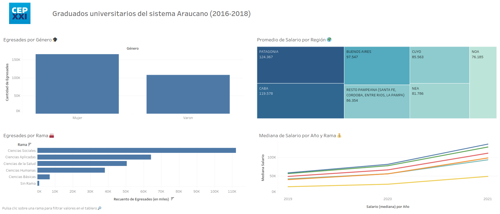

### Descripción

Sobre la base de datos de [Graduados Universitarios del Sistema Araucano](https://datos.produccion.gob.ar/dataset/graduados-universitarios-del-sistema-araucano-2016-2018) se realizó un renombrado de columnas con el paquete pandas en jupyter notebook. Posteriormente, los datos fueron procesados en Tableau para su análisis. Puede consultar el dashboard interactivo en https://public.tableau.com/app/profile/jess.garriga/viz/GraduadosuniversitariosdelsistemaAraucano2016-2018/Tablero.

